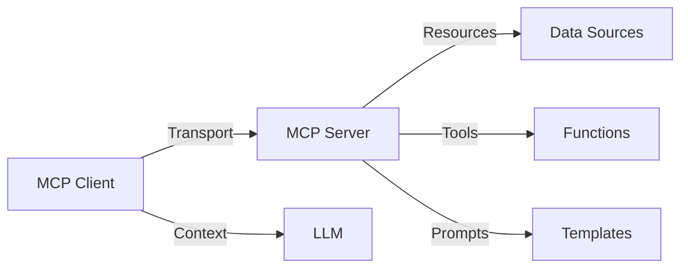

The Model Context Protocol (MCP) Kotlin SDK is a Kotlin Multiplatform implementation that enables applications to provide context for LLMs in a standardized way.

## What is MCP?

The Model Context Protocol allows applications to provide context for LLMs in a standardized way, separating the concerns of providing context from the actual LLM interaction. This architecture enables:

- **Modular context providers**: Build specialized servers that expose domain-specific resources
- **Reusable clients**: Create applications that can connect to any MCP-compliant server
- **Standardized communication**: Use a common protocol for all context exchanges
- **Multiple transports**: Deploy servers via STDIO, HTTP, SSE, or WebSocket

## Key Capabilities

The Kotlin SDK makes it easy to:

<CardGroup cols={2}>
  <Card title="Build MCP Clients" icon="desktop">
    Connect to any MCP server and consume resources, prompts, and tools
  </Card>
  <Card title="Create MCP Servers" icon="server">
    Expose resources, prompts, and tools to MCP clients
  </Card>
  <Card title="Multiplatform Support" icon="layer-group">
    Target JVM, Native, JS, and Wasm from a single codebase
  </Card>
  <Card title="Flexible Transports" icon="network-wired">
    Use STDIO, SSE, Streamable HTTP, or WebSocket transports
  </Card>
</CardGroup>

## Architecture

MCP uses a client-server architecture where:

- **Servers** expose context through resources, prompts, and tools
- **Clients** consume this context and integrate it with LLM interactions
- **Transports** provide the communication channel between clients and servers
- **Capabilities** declare what features each side supports



## Platform Support

The SDK supports:

- **JVM**: Java 11+
- **Native**: iOS, watchOS, tvOS, macOS, Linux, Windows
- **JavaScript**: Node.js and browser
- **Wasm**: WebAssembly targets

## Core Components

### Client

The [`Client`](https://kotlin.sdk.modelcontextprotocol.io/kotlin-sdk-client/io.modelcontextprotocol.kotlin.sdk.client/-client/index.html) class provides the API for connecting to servers and making requests:

```kotlin
val client = Client(
    clientInfo = Implementation(
        name = "my-client",
        version = "1.0.0"
    )
)

client.connect(transport)

// List and call tools
val tools = client.listTools().tools
val result = client.callTool("tool-name", arguments)
```

### Server

The [`Server`](https://kotlin.sdk.modelcontextprotocol.io/kotlin-sdk-server/io.modelcontextprotocol.kotlin.sdk.server/-server/index.html) class provides the API for exposing resources, prompts, and tools:

```kotlin
val server = Server(
    serverInfo = Implementation(
        name = "my-server",
        version = "1.0.0"
    ),
    options = ServerOptions(
        capabilities = ServerCapabilities(
            tools = ServerCapabilities.Tools(listChanged = true)
        )
    )
)

server.addTool(
    name = "example-tool",
    description = "An example tool"
) { request ->
    CallToolResult(content = listOf(TextContent("Result")))
}
```

## Next Steps

<CardGroup cols={2}>
  <Card title="MCP Primitives" icon="cube" href="/concepts/mcp-primitives">
    Learn about prompts, resources, tools, and sampling
  </Card>
  <Card title="Capabilities" icon="sliders" href="/concepts/capabilities">
    Understand how to declare server and client capabilities
  </Card>
  <Card title="Transports" icon="arrow-right-arrow-left" href="/concepts/transports">
    Explore STDIO, HTTP, SSE, and WebSocket options
  </Card>
  <Card title="Quickstart" icon="rocket" href="/quickstart">
    Build your first MCP client or server
  </Card>
</CardGroup>
